
<h1 align="center">计算机公共基础课程mooc教学平台的设计和实现+vue</h1>

## 简介
MOOC教学平台：角色分为管理员、教师、用户；功能包括课程管理、用户管理、知识分类管理、视频播放、试卷和试题管理、在线测试与视频评论交互、个人信息管理。    --计算机毕业设计源码；毕设源码；java毕业设计源码

## 联系方式

<h3 align="center">获取完整代码与数据库文件 + 微信：deepguan QQ: 86050149 QQ群: 783742310</h3>

<h3 align="center">可帮忙远程部署 包运行成功！提供远程部署、修改代码、设计文档指导、代码讲解等服务！</h3>

## 功能介绍（完整见运行截图）
管理员：负责平台的全面管理，包括用户管理、教师管理、课程管理、试题管理、视频管理和系统设置。可通过个人中心修改密码，管理用户信息以及上传课程和教学资源。管理员还可以编辑试卷和管理教学视频的评论，确保资源的更新与安排。登录后可随时退出，并在后台管理中综览所有功能模块。

教师：负责上传并管理自己的课程内容，如视频、文件和相关简介信息，确保资料的准确性和时效性。可以通过平台管理自己的教学视频、试卷和试题，进行试卷编辑和试题管理，以控制考试质量。教师可登录平台查看学生学习情况和评论反馈，并参与讨论区互动，提升教学效果。

学生：主要功能是访问和参与课程学习，包括浏览课程列表、观看教学视频和完成在线测试。学生可登录个人中心查看学习记录和错题本，进行信息修改，还可利用平台的互动功能如讨论区探讨问题、分享心得。学习视频页面提供资源下载和反馈机制，便于学生高效自学。

访客：可以浏览平台的基础功能界面，如课程列表和基础介绍，但无法进行深入的学习操作。如需获取更多功能权限，需注册成正式用户。页面设计引导性强，帮助访客快速了解平台特点和使用方法。

## 运行截图
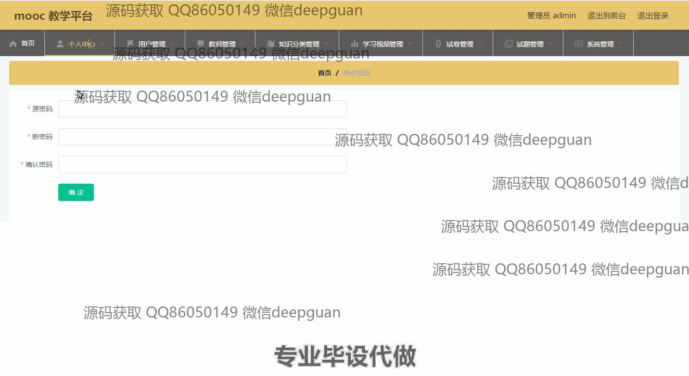
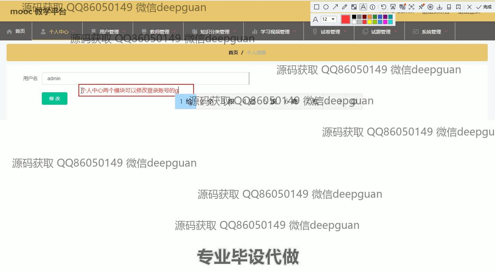
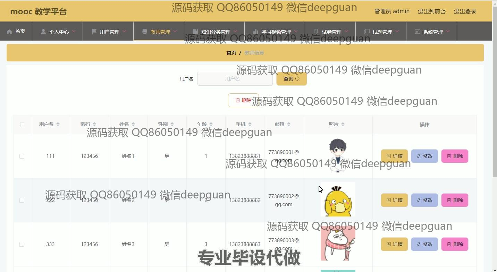
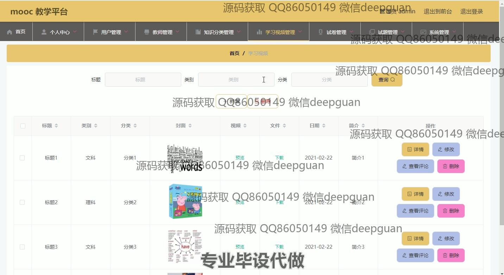
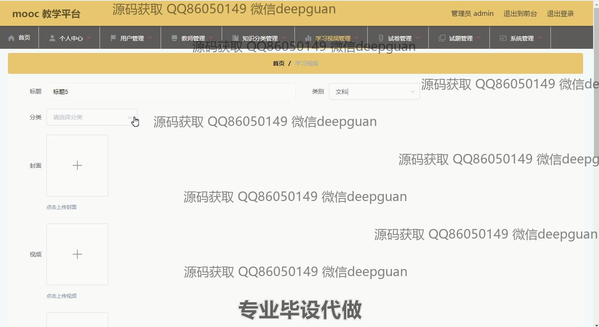
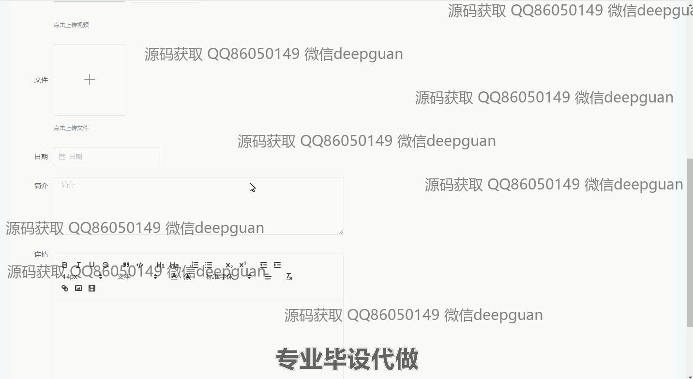

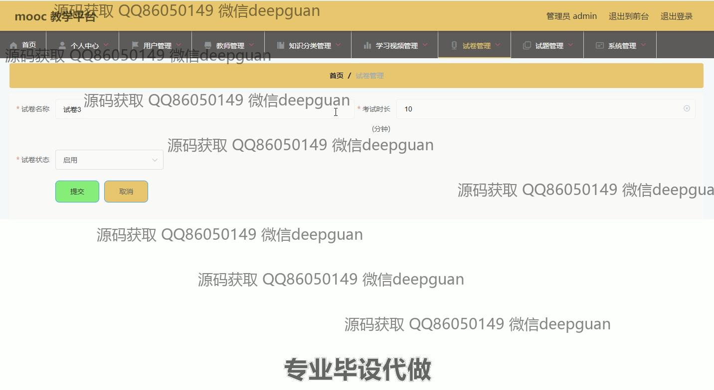
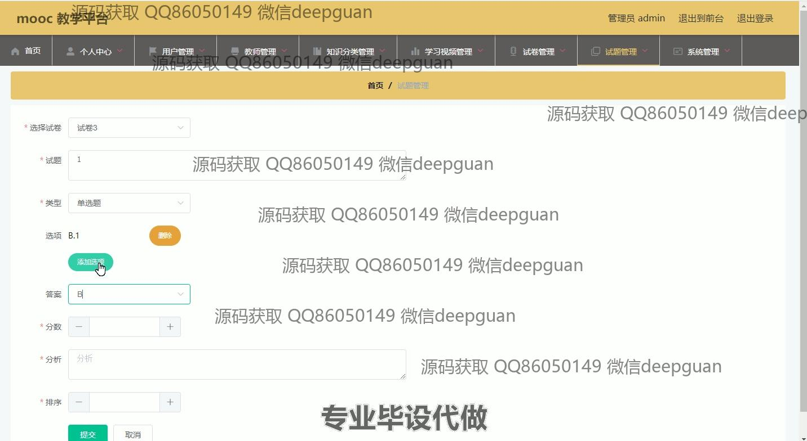
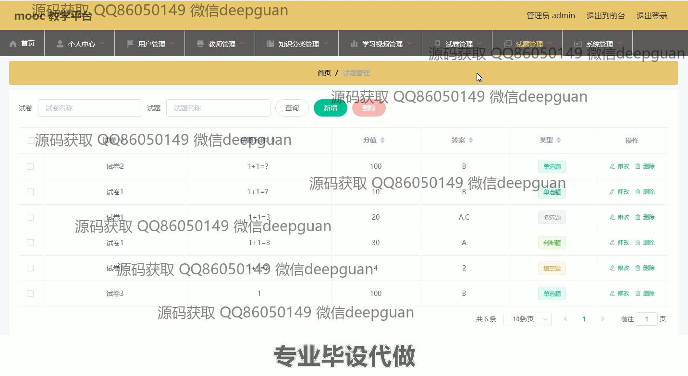
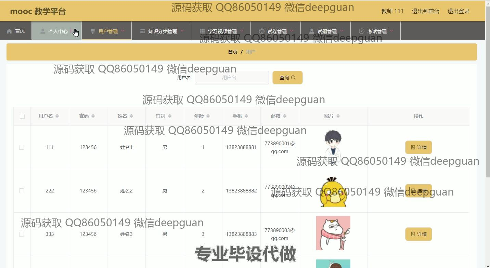
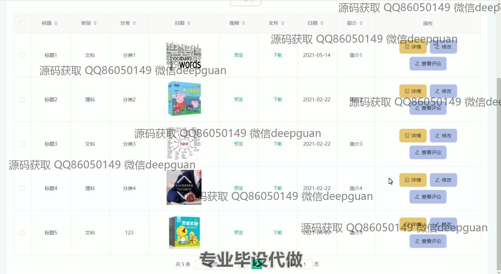
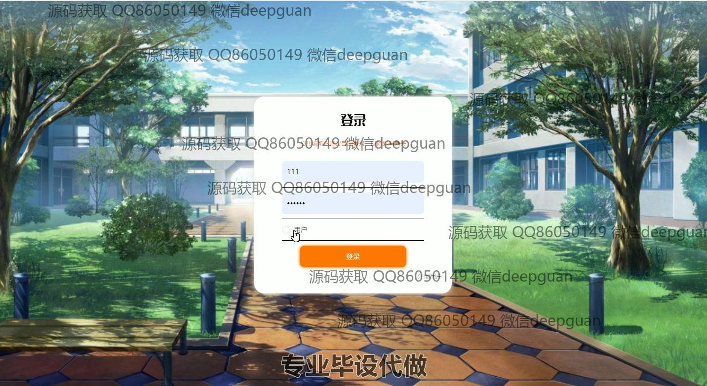
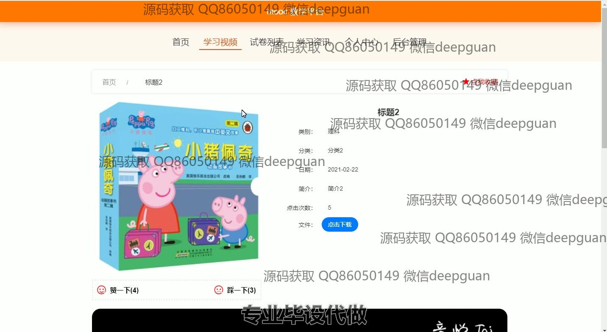
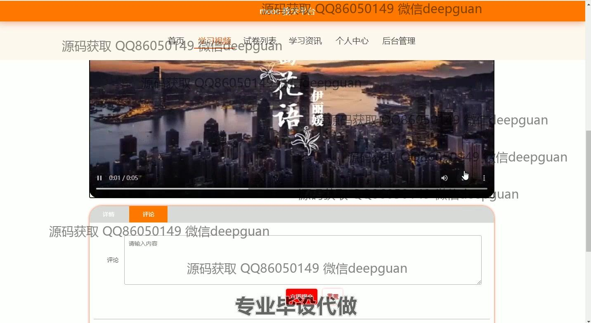
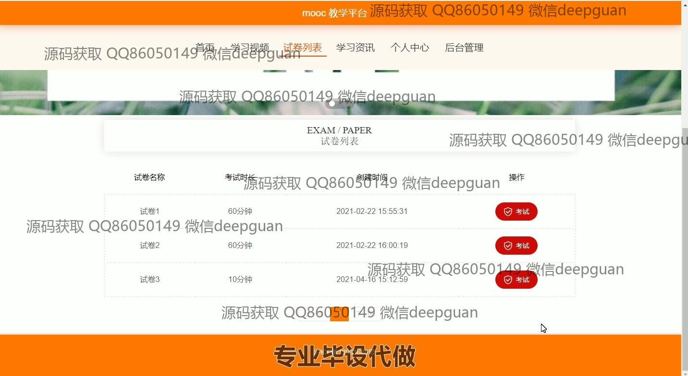
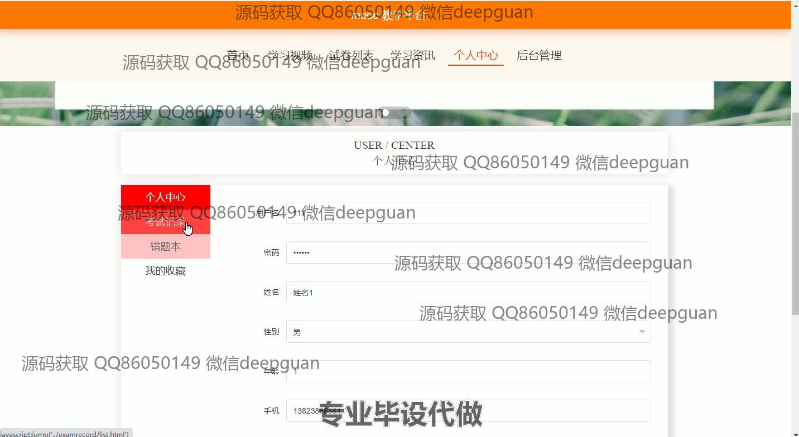
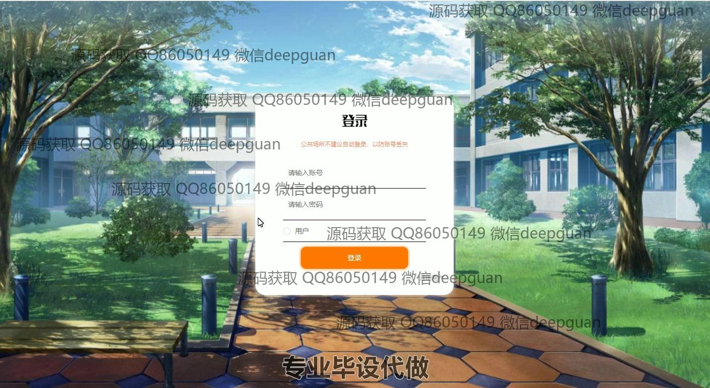
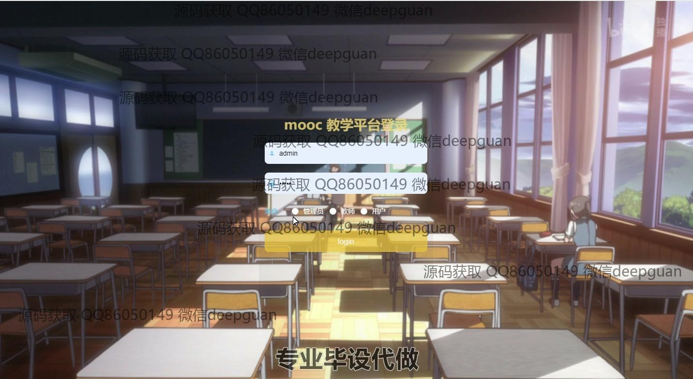
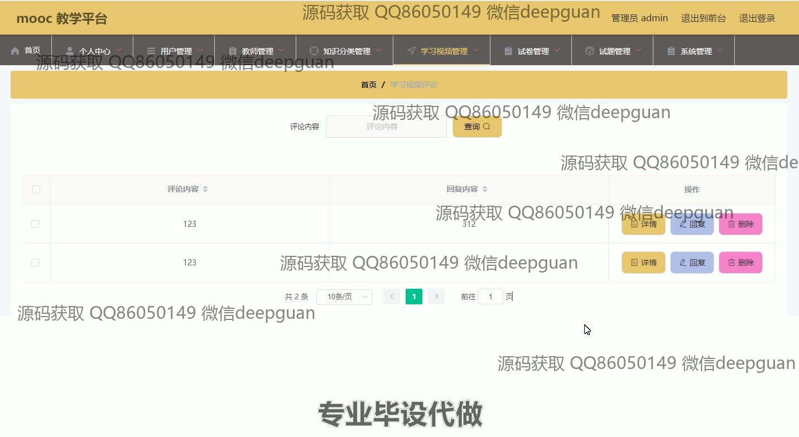

本代码来源于网络,仅供学习参考使用!

